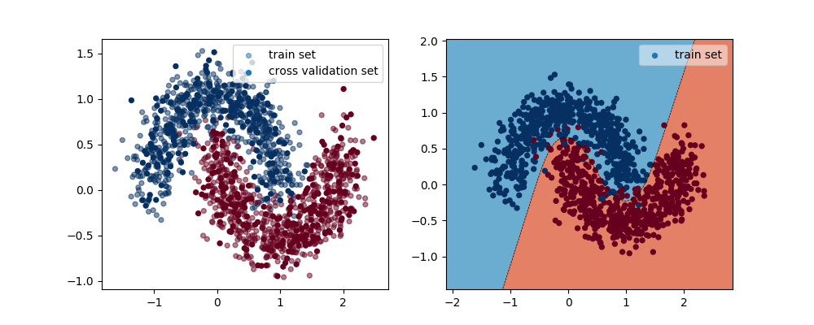
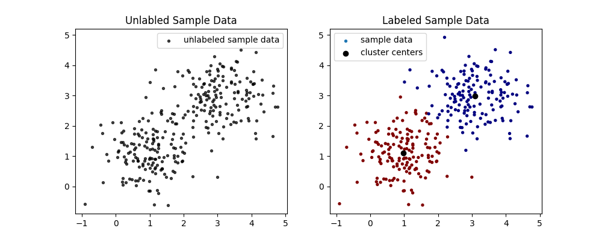

# Machine Learning 课程学习代码

这是上个暑假学习 Andrew Ng 的 [Machine Learning 课程](https://www.coursera.org/learn/machine-learning)的代码，课程偏理论，所以在学习的同时用python将课程中的算法实现了一下。算法实现只使用numpy库，可视化使用matplotlib，一些数据集使用sklearn.datasets。

> - `code`文件夹中带`01`-`14`编号的是普通课程代码，剩余两个`neuralnetwork.py`和`k_means.py`是两个模块。
> - 代码用于学习交流。


##  `neuralnetwork.py` 模块

由于课程需要多次写神经网络，所以写了该模块，用于快速生成、训练神经网络。

### 1. 建立一个神经网络

该模块含有`NeuralNetwork`类，可以轻松生成一个神经网络。建立一个`NeuralNetwork`实例需要4个参数：

-  `num_inputs`：输入层结点数
-  `num_hidden_layers`：隐藏层层数
-  `num_nodes_per_hidden`：每个隐藏层的节点数（只支持所有的隐藏层有相同的节点数）
-  `num_outputs`：输出层节点数

示例：建立输入层3个结点，2个隐藏层，每个隐藏层含有4个结点，输出层1个结点的神经网络，如下图所示。


​	图片来源于google.

```python
from neuralnetwork import NeuralNetwork

# 建立输入层3个结点，2个隐藏层，每个隐藏层含有4个结点，输出层1个结点的神经网络
nn = NeuralNetwork(3, 2, 4, 1)
```

### 2. 训练一个神经网络

`NeuralNetwork` 目前仅支持梯度下降法，有`gradient_descent`method。

```python
# 训练神经网络nn
Theta, steps, Js = nn.gradient_descent(X,  	# input数据
                Y,							# label数据
                ini_Theta,					# 初始化的神经网络参数矩阵（建立NeuralNetwork示例的时候已经初始化好了，直接使用nn.ini_Theta即可）
                alpha=0.01,					# 学习率
                lambda=1,   				# 正则化项
                exponential_decay=False,	# 是否用指数下降的学习率
                threshold=1e-7)				# 结束训练的损失函数阈值
```

训练完成后会返回：训练后的神经网络参数矩阵（`Theta`），训练过程中的训练步数（`steps`）以及训练过程中的损失函数值列表（`Js`）

### 3. 测试训练后的神经网络

神经网络训练后，只需要将测试数据、训练后的神经网络参数传入`forward_propagation`method中，进行一次前向传播即可得到训练后的结果。

```python
# 测试神经网络nn
h, A = nn.forward_propagation(X_test, 		# 测试数据
       		                  Theta)		# 训练后的神经网络参数
```

返回的`h`即为输出层的结果，`A`为前向传播过程中隐藏层各个节点的激活值。

### 4. 示例

具体代码见 [09.0_test_for_Neural_Network_module.py](./code/09.0_test_for_Neural_Network_module.py)




## `k_means.py`模块

### 1. 实现K_means算法

主要提供 `K_means` 函数，可以方便的实现K_means算法。

```python
from k_means import K_means

# 对未标记的input数据进行K-means算法
labels, mus, J = K_means(X,			# 未标记的input数据
                         K,			# 需要标记的种类数
                         times)		# 进行多少步算法迭代
```

该函数返回三个参数：`labels`是对于input数据的标记结果，`mus`是对于K个种类的质心坐标，`J`是标记结果对应的损失函数值。

### 2. 示例

具体代码见 [k_means.py](./code/k_means.py) 中的 `test`函数。

```
Already get dataset
the 1 times, J = 4.911510
the 2 times, J = 4.911510
the 3 times, J = 4.910132
the 4 times, J = 4.911510
the 5 times, J = 4.911510

Optimized J = 4.910132, costs 0.090155 s
Clusters' coordinates:
 [[3.08627186 2.98693656]
 [0.97862753 1.11267062]]
```



## 参考文献

[1]. 吴恩达机器学习课程 [https://www.coursera.org/learn/machine-learning](https://www.coursera.org/learn/machine-learning)


## License

MIT License

Copyright (c) 2019 tishacy

Permission is hereby granted, free of charge, to any person obtaining a copy of this software and associated documentation files (the "Software"), to deal in the Software without restriction, including without limitation the rights to use, copy, modify, merge, publish, distribute, sublicense, and/or sell copies of the Software, and to permit persons to whom the Software is furnished to do so, subject to the following conditions:

The above copyright notice and this permission notice shall be included in all copies or substantial portions of the Software.

THE SOFTWARE IS PROVIDED "AS IS", WITHOUT WARRANTY OF ANY KIND, EXPRESS OR IMPLIED, INCLUDING BUT NOT LIMITED TO THE WARRANTIES OF MERCHANTABILITY, FITNESS FOR A PARTICULAR PURPOSE AND NONINFRINGEMENT. IN NO EVENT SHALL THE AUTHORS OR COPYRIGHT HOLDERS BE LIABLE FOR ANY CLAIM, DAMAGES OR OTHER LIABILITY, WHETHER IN AN ACTION OF CONTRACT, TORT OR OTHERWISE, ARISING FROM, OUT OF OR IN CONNECTION WITH THE SOFTWARE OR THE USE OR OTHER DEALINGS IN THE SOFTWARE.


